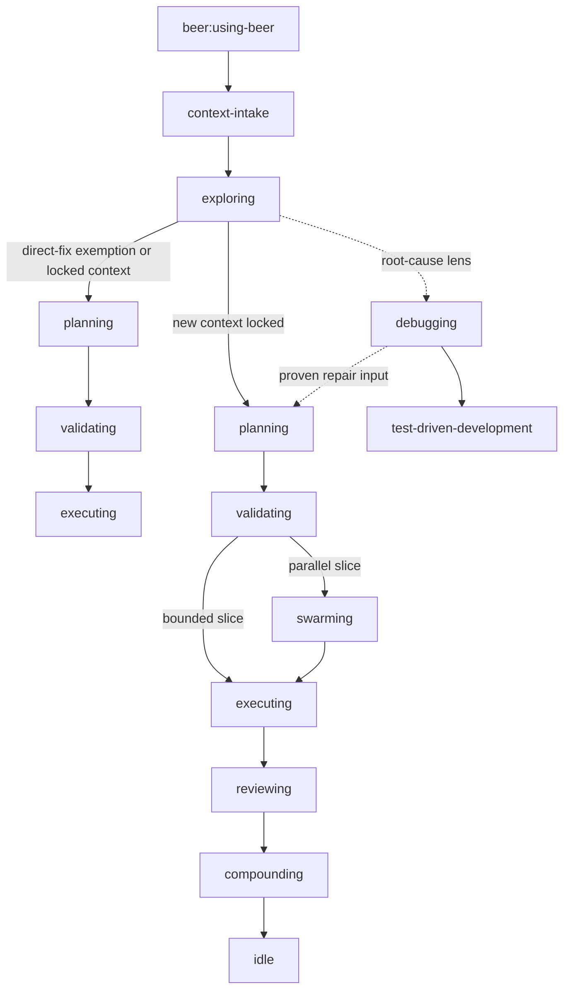

# Beer Skills

[](package.json)
[](docs/skill-inventory.json)
[](LICENSE.md)

Beer Skills is a reusable workflow bundle for agentic software delivery. It
packages the skills, route rules, and local scripts needed to guide an AI coding
agent through feature work, repair/investigation, validation, review, and learning capture.

## Start Here

- [Commands](COMMANDS.md)
- [Setup Guide](docs/setup.md)
- [Host Runtime Contract](docs/host-runtime-contract.md)
- [Skill Catalog](skill-catalog.md)
- [Flow Overview](docs/ecosystem-flow-overview.md)
- [Docs Index](docs/README.md)

## At a Glance

| Item | Value |
|---|---|
| Entry skill | `beer:using-beer` |
| Public CLI | `beer` / `beer-skills` |
| Skills shipped | `17` |
| Main feature flow | `context-intake -> exploring -> planning -> validating -> executing/swarming -> reviewing -> compounding -> idle` |
| Investigation / repair lens | `using-beer -> context-intake/exploring/planning` with `debugging` as needed |
| Required runtime | `node >= 18` |
| Optional accelerators | `bd`, GitNexus MCP + local index |

Beer currently ships **17 skills** across feature workflow, investigation
support, and meta layers.

## Quick Start

### Fast Path

```bash
npm install -g github:Huy-04/beer-skills
beer init
beer status
```

`beer init` automatically reinstalls Beer skills into `./.claude/skills/` and `./.agents/skills/`, syncs the managed `AGENTS.md` / `CLAUDE.md` guideline blocks, and configures repo-local hooks for Claude and Codex.

### Common Actions

| Goal | Command |
|---|---|
| Install Beer globally from GitHub | `npm install -g github:Huy-04/beer-skills` |
| Update the global Beer package and resync the current repo | `beer update` |
| Onboard the current repo | `beer init` |
| Refresh Beer files in the current repo | `beer refresh` |
| Remove Beer from the current repo | `beer uninstall --yes` |
| Check installed tools | `beer check-tools` |
| Install a tool such as GitNexus | `beer install gitnexus` |
| Check repo status | `beer status` |
| Start routing inside an agent session | `beer:using-beer` |

`beer:using-beer` is the entry skill. It chooses the smallest viable route from
the task shape, current Beer state, and available local dependencies.

Beer also keeps repo-local model-role defaults in `.beer/config.json`, so an
orchestrator can resolve different profiles for orchestration, coding, and
search/synthesis-heavy work instead of treating every worker the same.
For swarm-approved slices, `beer orchestrate` can resolve and materialize worker
assignments from the current Beer state, while `beer worker-bootstrap` emits the
spawn-ready payloads a host runtime can map into actual subagent launches.

Use `--repo-root /path/to/project` only when you want to target a different repo
than the current working directory.

Detailed setup: [docs/setup.md](docs/setup.md)  
Full command reference: [COMMANDS.md](COMMANDS.md)

## What Beer Provides

| Capability | What it means |
|---|---|
| Route-aware execution | small fixes can use a compact route; larger work gets the full context, planning, validation, execution, and review flow |
| Explicit context contracts | `.beer/seed/` stores inferred context; `history/<feature>/CONTEXT.md` stores locked decisions |
| Validation before coding | feature work passes through a go/no-go step before implementation begins |
| Parallel execution support | validated slices can run directly or through a swarm when `bd` is available |
| Reusable learning capture | completed work can promote durable patterns into `history/learnings/` |
| Repo-local model roles | `.beer/config.json` can pin different model/reasoning defaults for orchestrator, coding, and research/synthesis work |

## Runtime Profile

| Topic | Summary |
|---|---|
| Required runtime | `node >= 18` |
| Standard path | `node` + `bd` |
| Graph-augmented path | GitNexus MCP plus a local index |
| Full setup details | [docs/setup.md](docs/setup.md) |
| Full command list | [COMMANDS.md](COMMANDS.md) |

## Commands

Beer command reference lives in [COMMANDS.md](COMMANDS.md).

## Workflow Snapshot



Beer keeps one main workflow. `context-intake` is the entry gate for repo work,
while `debugging` is an evidence-first lens used inside that flow when the task
is a bug, a failing build/test, or a repair that needs root-cause proof.

## Session Model

| Axis | Values | Meaning |
|---|---|---|
| `route` | `feature`, `small-fix` | workflow path and prerequisites |
| `work_intent` | `delivery`, `repair`, `investigation` | whether the current work is new delivery, a fix, or diagnosis |
| `risk` | `normal`, `high` | blast radius and reversibility |
| `orchestration_strategy` | `single-worker`, `multi-worker` | execution topology after validation |
| `run_style` | `guided`, `go` | how aggressively Beer crosses gates |

Use `beer-skills auto-accept` from an installed package, or
`node .beer/scripts/commands/beer-auto-accept.mjs` before any automatic gate
crossing. It returns `ALLOW` only when `run_style = go` or `auto_accept` policy
permits the gate and no blocker, high-risk condition, missing evidence, or
missing coordination tool makes the move unsafe.

### Common Combinations

| Common combination | Typical route |
|---|---|
| `small-fix + normal + single-worker + guided` | intake, exploring sanity-check, compact planning, validation, and direct execution |
| `feature + normal + single-worker + guided` | full feature workflow with one bounded implementation stream |
| `feature + normal/high + multi-worker + guided` | full workflow plus coordinated worker slices and deeper validation |
| `feature + normal/high + single/multi-worker + go` | same workflow with configurable auto-advance where allowed |

`beer:using-beer` owns live request understanding and decides the smallest
viable route and orchestration strategy during the agent session itself.

## Where Next

- [Documentation Index](docs/README.md)
- [Commands Reference](COMMANDS.md)
- [Setup Guide](docs/setup.md)
- [Host Runtime Contract](docs/host-runtime-contract.md)
- [Skill Catalog](skill-catalog.md)
- [Ecosystem Flow Overview](docs/ecosystem-flow-overview.md)
- [Seed Context Contract](docs/seed-context-contract.md)
- [Skill Authoring Pattern](docs/skill-authoring/skill-pattern.md)
- [Contributing](CONTRIBUTING.md)

## License

[PolyForm Noncommercial License 1.0.0](LICENSE.md)
