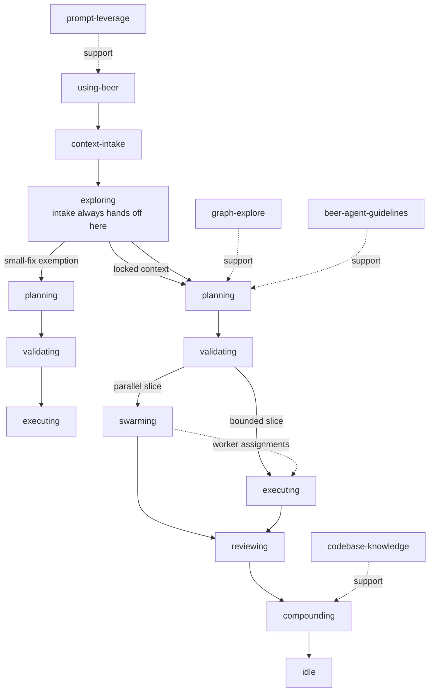
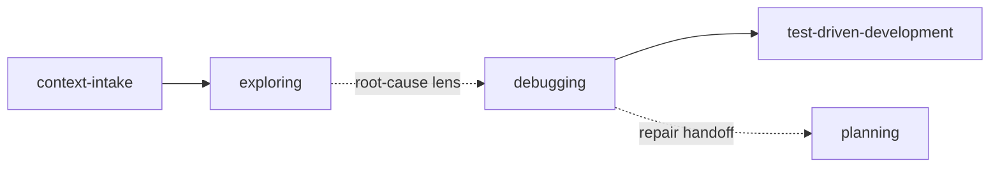

# Beer Ecosystem Flow Overview

Beer currently ships **17 skills** across four categories:

| Category | Count | Purpose |
|---|---|---|
| Workflow - feature | 9 | End-to-end feature delivery |
| Investigation / repair lens | 1 | Root-cause and repair support inside the main workflow |
| Support | 5 | Utilities and focused helper passes |
| Meta | 2 | Skills for evolving Beer itself |

The core idea is simple: Beer chooses the safest route, risk level, and
orchestration strategy that can handle the task, then records enough state for
the next skill or session to continue without guessing.

## End-to-End Feature Flow

Debugging is an in-flow lens, not a separate branch:

## Human Gates

| Gate | After | Why it exists |
|---|---|---|
| Gate 1 | `exploring` | lock decisions before planning fans out |
| Gate 2 | `planning` | approve the current execution slice |
| Gate 3 | `validating` | confirm that execution should proceed directly or through a swarm |
| Gate 4 | `reviewing` | stop closeout when findings or UAT show the work is not ready |

## Workflow Categories

### Workflow - Feature

| Skill | Purpose |
|---|---|
| `using-beer` | entry point, routing, gates, and resume logic |
| `context-intake` | recover context, load or seed it, and hand off to exploring |
| `exploring` | lock product or implementation decisions into `CONTEXT.md` |
| `planning` | turn the active route into an execution plan and lock worker strategy |
| `validating` | decide whether the planned worker strategy and slice boundaries are safe to execute |
| `swarming` | coordinate parallel workers for a swarm-approved slice |
| `executing` | implement the active direct slice or swarm assignment |
| `reviewing` | run the quality gate before closeout |
| `compounding` | capture reusable learnings after review or debugging |

### Investigation / Repair Lens

| Skill | Purpose |
|---|---|
| `debugging` | evidence-first triage, reproduction, root cause, and repair guidance inside the main flow |

### Support

| Skill | Purpose |
|---|---|
| `prompt-leverage` | build a context-aware execution prompt from a raw request and apply Beer language policy |
| `graph-explore` | query GitNexus for structure, flow, and impact context |
| `test-driven-development` | supply RED -> GREEN -> REFACTOR evidence for behavior changes |
| `codebase-knowledge` | maintain `.beer/knowledge-base/` as a project-local pattern-first implementation map |
| `beer-agent-guidelines` | install or refresh Karpathy-style guardrails in `CLAUDE.md` and `AGENTS.md` |

### Meta

| Skill | Purpose |
|---|---|
| `writing-beer-skills` | create or update Beer skills |
| `xia` | research external skill repos and propose Beer adoption candidates |

## Shared Artifacts

| Artifact | Meaning |
|---|---|
| `.beer/onboarding.json` | whether Beer is installed in the target repo |
| `.beer/state.json` | authoritative machine-readable workflow state |
| `.beer/STATE.md` | human-readable derived state |
| `.beer/HANDOFF.json` | resume handoff for context pressure or interruptions |
| `.beer/seed/` | inferred context that still needs `exploring` |
| `history/<feature>/CONTEXT.md` | locked context for a feature |
| `history/<feature>/discovery.md` | planning research notes |
| `history/<feature>/approach.md` | planning synthesis and risk map |
| `history/<feature>/phase-plan.md` | route-level phase breakdown |
| `history/learnings/critical-patterns.md` | promoted learnings reused by later work |

`.beer/state.json` is the authoritative state file. `.beer/STATE.md` is a
human-readable derivative and should not become the source of truth.

## Route and Dependency Profile

| Route | Minimum dependency set |
|---|---|
| Onboarding / status | `node` |
| `single-worker` execution path | `node` |
| `multi-worker` execution path | `node` + `bd` |
| Graph augmentation | configured GitNexus MCP server plus an indexed repo |

## Related Docs

- [README](../README.md)
- [Seed Context Contract](seed-context-contract.md)
