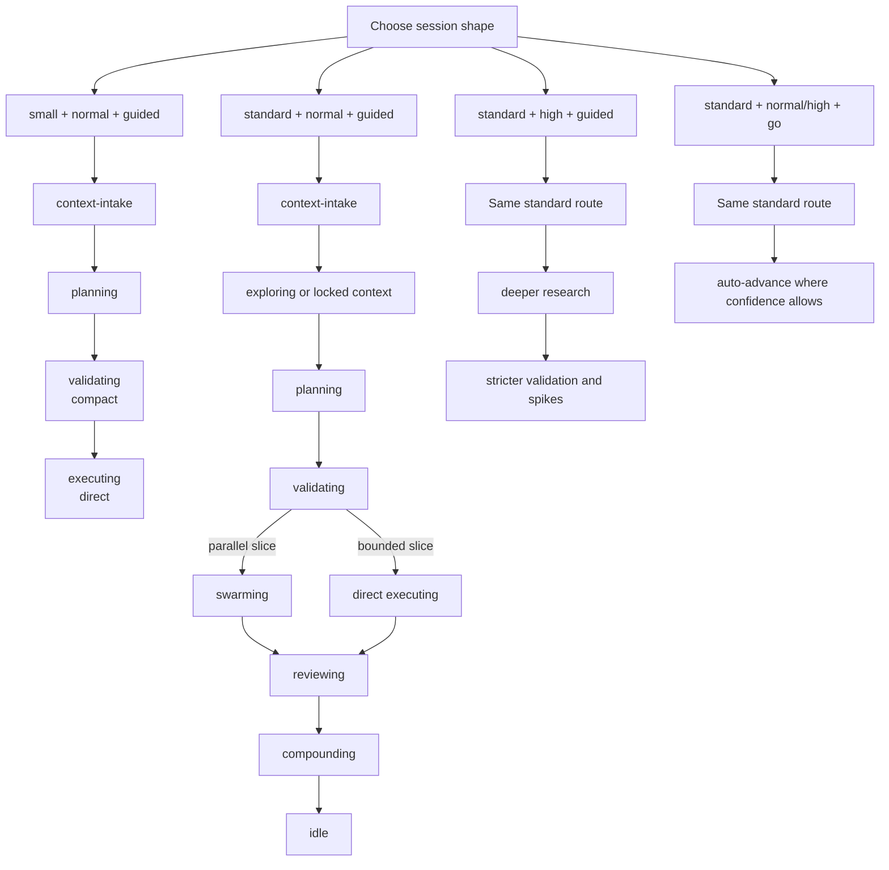

# Mode Comparison

Beer does not collapse everything into one long mode label. It uses three
separate axes:

- `mode`: `small` or `standard`
- `risk`: `normal` or `high`
- `run_style`: `guided` or `go`

Route fields are separate from those axes:

- `planning_route`: `feature`, `small-fix`, or `debug-escalation`
- `execution_target`: `executing` or `swarming`

## The Three Axes

| Axis | Values | What it controls |
|---|---|---|
| `mode` | `small`, `standard` | workflow size, artifact depth, coordination overhead |
| `risk` | `normal`, `high` | research depth, caution level, and whether spikes are likely |
| `run_style` | `guided`, `go` | how aggressively Beer crosses approval gates |

`beer:using-beer` produces the canonical session shape and route recommendation
for a specific request during the live agent session.
Run `node .beer/scripts/commands/beer-auto-accept.mjs --gate <gate> --json` before any
automatic gate crossing.

## Common Session Shapes

| Combination | Typical use case | Typical route |
|---|---|---|
| `small + normal + guided` | bug fix, typo, bounded refactor | `using-beer -> context-intake -> planning -> validating -> executing` with a compact gate |
| `standard + normal + guided` | normal feature work | `using-beer -> context-intake -> exploring -> Gate 1 -> planning -> validating -> swarming/executing -> reviewing -> compounding -> idle` |
| `standard + high + guided` | cross-cutting, risky, or hard-to-reverse change | same standard route plus deeper research and stricter validation |
| `standard + normal/high + go` | trusted end-to-end run with fewer pauses | same standard route, but Beer may auto-advance where confidence allows |

## Small vs Standard

| Topic | `small` | `standard` |
|---|---|---|
| Scope | tight, bounded work | multi-step feature or larger change |
| Context | always passes through intake, but usually routes forward quickly | full context recovery and locked-context enforcement when needed |
| Planning output | compact plan | `discovery.md`, `approach.md`, `phase-plan.md`, and current-slice artifacts |
| Validation | compact direct pass before execution | formal validation with route choice and spike support |
| Execution | direct single-worker path after validation | direct execution for bounded slices or swarm for parallel slices |
| Review | proportional review or optional lightweight follow-up | full review gate with UAT and closeout |
| Compounding | optional if nothing reusable emerged | expected for completed feature work |

## Dependency Reality by Route

| Route | Minimum dependency set |
|---|---|
| Onboarding or status only | `node` |
| Small guided work | `node` |
| Standard flow | `node` + `bd` |
| Swarm execution path | `node` + `bd` |
| Graph-augmented discovery | configured GitNexus MCP server plus an indexed repo |

`mode` does not override missing dependencies. Beer should route to the highest
viable path instead of pretending the full workflow is available.

## Practical Examples

| Request | Session shape |
|---|---|
| "Fix a null check in one controller" | `small + normal + guided` |
| "Add a new dashboard widget using an existing pattern" | `standard + normal + guided` |
| "Refactor auth boundaries across the app" | `standard + high + guided` |
| "Run the full pipeline and pause only at hard gates" | `standard + normal/high + go` |

## Related Docs

- [README](../README.md)
- [Mode Selection](mode-selection.md)
- [Ecosystem Flow Overview](ecosystem-flow-overview.md)
