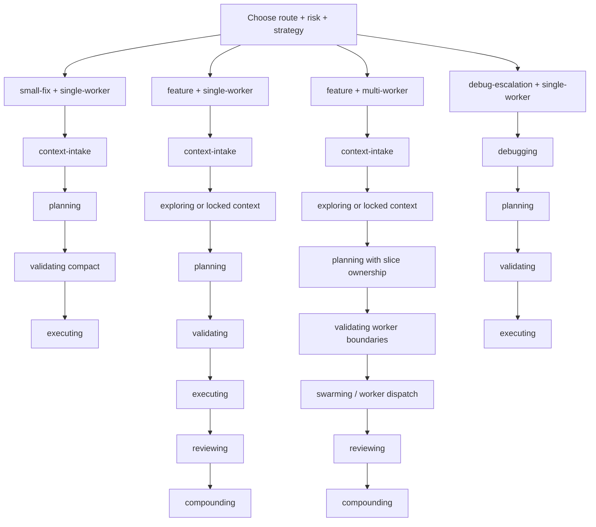

# Route And Strategy Comparison

Beer now uses four explicit axes:

- `route`: `feature`, `small-fix`, `debug-escalation`
- `risk`: `normal`, `high`
- `orchestration_strategy`: `single-worker`, `multi-worker`
- `run_style`: `guided`, `go`

`beer:using-beer` produces the canonical combination during the live session.
Run `node .beer/scripts/commands/beer-auto-accept.mjs --gate <gate> --json`
before any automatic gate crossing.

## The Four Axes

| Axis | Values | What it controls |
|---|---|---|
| `route` | `feature`, `small-fix`, `debug-escalation` | workflow shape and prerequisites |
| `risk` | `normal`, `high` | research depth, caution level, and whether spikes are likely |
| `orchestration_strategy` | `single-worker`, `multi-worker` | execution topology after validation |
| `run_style` | `guided`, `go` | how aggressively Beer crosses approval gates |

## Common Session Shapes

| Combination | Typical use case | Typical route |
|---|---|---|
| `small-fix + normal + single-worker + guided` | bug fix, typo, bounded refactor | `using-beer -> context-intake -> planning -> validating -> executing` with a compact gate |
| `feature + normal + single-worker + guided` | normal feature work with one bounded stream | `using-beer -> context-intake -> exploring -> planning -> validating -> executing -> reviewing -> compounding -> idle` |
| `feature + normal/high + multi-worker + guided` | decomposable feature with disjoint slices | same feature route, but validation dispatches multiple workers after Gate 3 |
| `feature/debug-escalation + normal/high + any strategy + go` | trusted end-to-end run with fewer pauses | same route, but Beer may auto-advance where confidence allows |

## Single-Worker vs Multi-Worker

| Topic | `single-worker` | `multi-worker` |
|---|---|---|
| Scope | one bounded execution stream | multiple disjoint slices |
| Planning output | slice focus, proof target, one owner | slice map, ownership boundaries, merge-safe plan |
| Validation | confirm one worker is enough | confirm slices are independent and coordination is safe |
| Execution | one implementation stream | coordinated worker execution |
| Review | one stream plus validator checks | integrated worker output plus validator checks |

## Dependency Reality By Strategy

| Route or capability | Minimum dependency set |
|---|---|
| Onboarding or status only | `node` |
| `single-worker` execution path | `node` |
| `multi-worker` execution path | `node` + `bd` |
| Graph-augmented discovery | configured GitNexus MCP server plus an indexed repo |

`route` and `orchestration_strategy` do not override missing dependencies.
Beer should route to the highest viable path instead of pretending the full
workflow is available.

## Practical Examples

| Request | Session shape |
|---|---|
| "Fix a null check in one controller" | `small-fix + normal + single-worker + guided` |
| "Add invoice PDF export to order history" | `feature + normal + single-worker or multi-worker + guided` |
| "Refactor auth boundaries across the app" | `feature + high + multi-worker + guided` |
| "Run the full pipeline and pause only at hard gates" | keep route/risk/strategy, switch `run_style = go` |

## Related Docs

- [README](../README.md)
- [Route And Orchestration Selection](route-selection.md)
- [Ecosystem Flow Overview](ecosystem-flow-overview.md)
