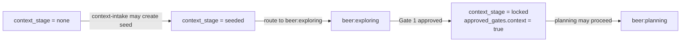

# Seed Context Contract

Beer separates inferred context from locked decisions so the rest of the
workflow can trust `history/<feature>/CONTEXT.md` without guessing how it was
created.

## Core Rule

- `.beer/seed/` is inferred context
- `history/<feature>/CONTEXT.md` is locked context
- only `beer:exploring` may write `history/<feature>/CONTEXT.md`

## Ownership

### `beer:context-intake`

Allowed to:

- load existing locked context
- inspect state, handoff, and resume signals
- create or refresh `.beer/seed/`
- update `.beer/state.json` to reflect `context_stage`

Not allowed to:

- write `history/<feature>/CONTEXT.md`
- assign decision IDs such as `D1`, `D2`
- let planning proceed from seed alone

### `beer:exploring`

Allowed to:

- read `.beer/seed/`
- ask targeted questions from seed context
- confirm or reject inferred assumptions
- write `history/<feature>/CONTEXT.md`
- promote `context_stage` from `seeded` to `locked`

## State Model

`.beer/state.json` should track:

```json
{
  "context_stage": "none | seeded | locked",
  "seed_path": ".beer/seed/",
  "context_path": "history/<feature>/CONTEXT.md",
  "context_confidence": 0.0,
  "approved_gates": {
    "context": false
  },
  "auto_accept": {
    "enabled": false
  }
}
```

When `context_confidence < 0.7`, `auto_accept.enabled` must be `false`.

## Routing Rules



- `context_stage = none` -> `context-intake` may create seed
- `context_stage = seeded` -> route to `beer:exploring`
- `context_stage = locked` plus `approved_gates.context = true` -> `beer:planning` may proceed

## Seed Rules

Seed files may contain:

- observations
- inferred structure
- candidate constraints
- relevant file paths
- open questions

Seed files must not contain:

- locked decisions
- D-series decision IDs
- claims that downstream skills should treat as already approved

## Planning Rule

For the feature route, `beer:planning` reads only locked `CONTEXT.md` as the
feature contract.

If only `.beer/seed/` exists on the feature route, planning must stop and route back to
`beer:exploring`.

Small direct fixes and debug-escalation repairs may use route-specific planning
without locked feature context when `beer-planning-gate.mjs --route small-fix`
or `--route debug-escalation` passes. Those routes must stay narrow and must
return to `beer:exploring` if the work becomes scope-shaping.

## Technical Enforcement

- `node .beer/scripts/commands/beer-planning-gate.mjs --route feature` must pass before feature planning starts
- `node .beer/scripts/commands/beer-planning-gate.mjs --route small-fix` or `--route debug-escalation` may pass without locked context for narrow repair routes
- the gate fails when onboarding or state is missing
- on the feature route, the gate fails when `context_stage != locked`
- on the feature route, the gate fails when locked state points to a missing `CONTEXT.md`
- on the feature route, the gate fails when `approved_gates.context != true`

## Related Docs

- [README](../README.md)
- [Ecosystem Flow Overview](ecosystem-flow-overview.md)
