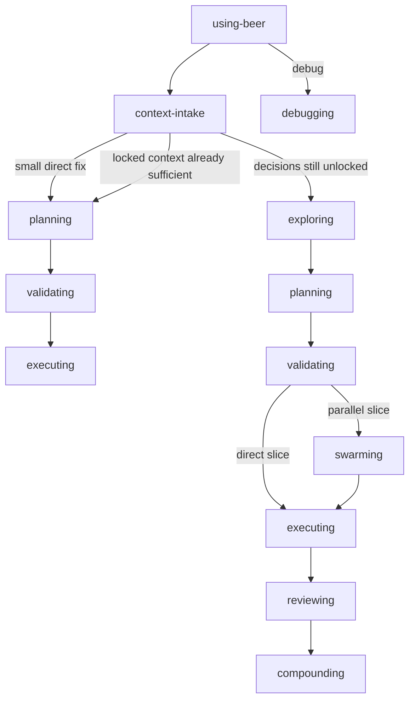

# Beer Skill Catalog

Public reference for the **17 skills** in the Beer ecosystem.

## Workflow

### Feature Workflow (9)

| Skill | When to invoke | Key output |
|---|---|---|
| `beer:using-beer` | Start of session, resume, route selection | Routing decision and state bootstrap |
| `beer:context-intake` | Feature work without usable context, resume, or zero-context startup | Recovered context or seeded inferred context |
| `beer:exploring` | Decisions are still ambiguous and must be locked | `history/<feature>/CONTEXT.md` |
| `beer:planning` | Context is locked and the next execution slice must be planned | `discovery.md`, `approach.md`, `phase-plan.md` |
| `beer:validating` | Planned slice needs a go/no-go decision | Validation outcome and execution route |
| `beer:swarming` | A validated slice is approved for parallel execution | Coordinated worker execution state |
| `beer:executing` | Direct execution path or swarm worker implementation | Implemented slice plus verification |
| `beer:reviewing` | Execution is complete and quality/closeout must be checked | Findings, UAT outcome, closeout decision |
| `beer:compounding` | Feature work or debug work finished with reusable lessons | Learnings file and promoted critical patterns |

### Debug Workflow (1)

| Skill | When to invoke | Key output |
|---|---|---|
| `beer:debugging` | Build failures, runtime errors, blocked work, failing tests, or integration issues | Root cause and repair path |

## Support (5)

| Skill | When to invoke | Key output |
|---|---|---|
| `beer:prompt-leverage` | A raw prompt needs context, structure, or normalization | Execution-ready prompt with preserved intent and language policy |
| `beer:graph-explore` | GitNexus-backed structure, flow, or impact lookup | Graph-derived findings or degraded status |
| `beer:test-driven-development` | Behavior work needs fail-first proof | RED -> GREEN -> REFACTOR loop |
| `beer:codebase-knowledge` | Project-local knowledge cache should be created or refreshed | `.beer/knowledge-base/` cache |
| `beer:agent-docs-sync` | Update CLAUDE.md or AGENTS.md with behavioral guidelines | Surgically merged context file |

## Meta (2)

| Skill | When to invoke | Key output |
|---|---|---|
| `beer:writing-beer-skills` | Create or refactor Beer skills | Updated skill package and validation notes |
| `beer:xia` | Research external skill repos or upstream patterns before Beer adoption work | Research brief and adoption recommendation |

## Route Summary



## Human Gates

| Gate | After skill | Required action |
|---|---|---|
| Gate 1 | `beer:exploring` | Approve `CONTEXT.md` before planning |
| Gate 2 | `beer:planning` | Approve `phase-plan.md` before current-slice prep |
| Gate 3 | `beer:validating` | Approve execution |
| Gate 4 | `beer:reviewing` | Approve merge or follow-up fixes |

## Session Model

| Axis | Values | Notes |
|---|---|---|
| `mode` | `small`, `standard` | Task size and workflow depth |
| `risk` | `normal`, `high` | Blast radius and reversibility |
| `run_style` | `guided`, `go` | Gate automation preference |

| Common combination | Typical route |
|---|---|
| `small + normal + guided` | `using-beer -> context-intake -> planning -> validating -> executing` |
| `standard + normal + guided` | full feature workflow |
| `standard + high + guided` | full feature workflow plus deeper research and stricter validation |
| `standard + normal/high + go` | full workflow with configurable auto-accept |

## Utility Commands

Install and onboarding live in [README](README.md). This catalog only keeps the
day-to-day inspection commands that are useful once Beer is already available.

From an onboarded target repo:

```bash
node .beer/scripts/commands/beer-status.mjs --json
node .beer/scripts/commands/beer-dependencies.mjs
```

From the Beer repo itself:

```bash
node scripts/commands/beer-status.mjs --json
node scripts/commands/beer-dependencies.mjs
```

## Related Docs

- [README](README.md)
- [Documentation Index](docs/README.md)
- [Ecosystem Flow Overview](docs/ecosystem-flow-overview.md)
- [Mode Selection](docs/mode-selection.md)
- [Mode Comparison](docs/mode-comparison.md)
