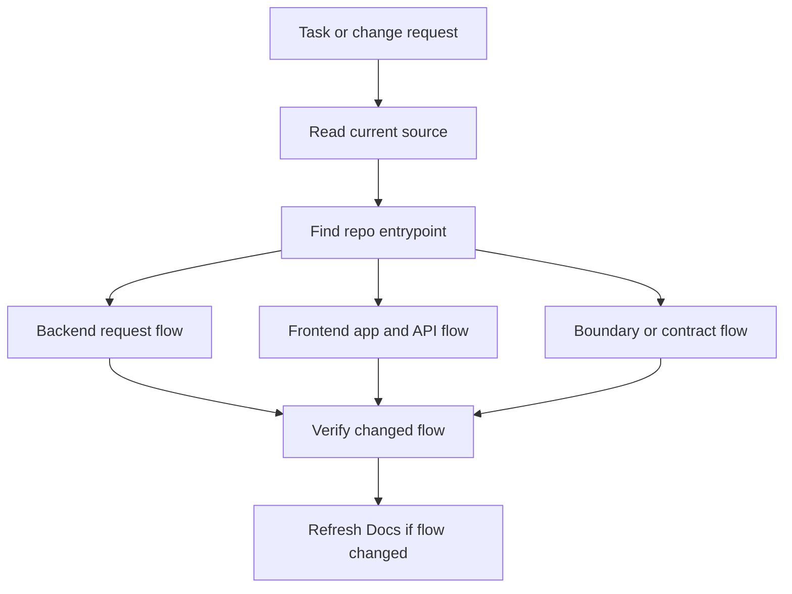

# Example Output

This is an illustrative output shape for a route/service backend. Real entries
must be generated from current source evidence, and layered repos may choose
paths such as `Backend/patterns/request-lifecycle.md` instead.

## Directory Shape

```text
Docs/
  00-metadata.json
  index.json
  README.md
  Flows/
    repo-flow.md
  Architecture/
    system-overview.md
  Backend/
    request-lifecycle.md
  Frontend/
    app-structure-and-api-access.md
  Boundaries/
    frontend-backend-proxy.md
  CriticalFlows/
    auth-session.md
  Conventions/
    implementation-rules.md
```

## 00-metadata.json

```json
{
  "version": "1.0",
  "generated_at": "2026-04-25T10:30:00Z",
  "generated_from_commit": "abc123",
  "source_authority": "current repository source",
  "commit_policy": "local-cache-by-default",
  "invocation_reason": "user-request",
  "scan_scope": "full",
  "mode": "gitnexus-assisted",
  "strategy": "pattern-first",
  "gitnexus_status": "available",
  "source_path": ".",
  "repo_shape": "Node-based skill and workflow repository",
  "discovery": {
    "pre_scan": "real-repo-scan",
    "execution": "parallel-child-agents",
    "synthesis": "single-writer",
    "evidence_priority": "gitnexus-first",
    "lanes": ["architecture-and-conventions", "backend", "frontend", "boundaries", "critical-flows"],
    "optional_lanes": ["integration-patterns", "state-boundaries"]
  },
  "stats": {
    "files_scanned": 128,
    "patterns_detected": 5,
    "docs_generated": 5,
    "discovery_lanes": 4
  },
  "confidence_summary": {
    "high": 4,
    "medium": 2,
    "low": 0
  }
}
```

## index.json

```json
{
  "version": "1.0",
  "generated_at": "2026-04-25T10:30:00Z",
  "strategy": "pattern-first",
  "stats": {
    "total_files": 128,
    "generated_docs": 5,
    "flow_docs": 1,
    "backend_docs": 1,
    "frontend_docs": 1,
    "boundary_docs": 1,
    "critical_flows": 1
  },
  "entries": [
    {
      "title": "Request Lifecycle",
      "area": "backend",
      "kind": "pattern",
      "role": "backend-request-lifecycle",
      "architecture_style": "route-service-backend",
      "file": "Backend/request-lifecycle.md",
      "confidence": "high",
      "tags": ["backend", "request", "lifecycle"],
      "summary": "Shows the standard backend path from request entrypoint to persistence and side effects."
    },
    {
      "title": "Repository Flow Map",
      "area": "flows",
      "kind": "flow-map",
      "role": "repo-flow-map",
      "file": "Flows/repo-flow.md",
      "confidence": "high",
      "tags": ["flow", "entrypoints", "verification"],
      "summary": "Default map of how implementation work should trace through this repo before changing code."
    }
  ],
  "dominant_patterns": [
    {
      "name": "Route/service backend request flow",
      "confidence": "high",
      "areas": ["architecture", "backend"],
      "summary": "Routes stay thin while service and persistence helpers coordinate the real work."
    }
  ],
  "task_index": {
    "add backend endpoint": {
      "docs": [
        "Backend/request-lifecycle.md",
        "Conventions/implementation-rules.md"
      ],
      "pattern_targets": ["backend.pattern_groups.request-lifecycle"]
    }
  },
  "backend": {
    "pattern_groups": {
      "request-lifecycle": {
        "architecture_style": "route-service-backend",
        "mission": "orchestrate backend request flow while preserving the architecture style actually detected in this repo",
        "dominant_patterns": [
          "thin route orchestration",
          "delegation into service helpers",
          "boundary-aware persistence or API helpers"
        ],
        "verification_targets": {
          "symbols": ["CreateUserHandler"],
          "processes": ["CreateUser"]
        }
      }
    },
    "flow_patterns": {
      "request-lifecycle": {
        "docs": ["Backend/request-lifecycle.md"]
      }
    }
  },
  "frontend": {
    "pattern_groups": {},
    "flow_patterns": {}
  },
  "flows": {
    "repo-flow": {
      "docs": ["Flows/repo-flow.md"]
    }
  },
  "boundaries": {
    "auth-session": {
      "docs": ["CriticalFlows/auth-session.md"],
      "verification_targets": {
        "processes": ["AuthSession"]
      }
    }
  },
  "critical_files": [
    "src/auth/session.ts"
  ],
  "conventions": {
    "files": "kebab-case markdown docs",
    "source_authority": "current repository source"
  },
  "search_index": {
    "auth": ["CriticalFlows/auth-session.md"],
    "request lifecycle": ["Backend/request-lifecycle.md"]
  }
}
```

## Backend/request-lifecycle.md

```markdown
---
area: backend
kind: pattern
pattern: request lifecycle
detected_at: 2026-04-25T10:30:00Z
confidence: high
file_count: 8
source_authority: current repository source
status: current
---

# Request Lifecycle

## What This Is
The standard backend path from entrypoint to persistence and side effects.

## Why It Exists Here
This codebase keeps entrypoints thin and pushes coordination into service and persistence helpers.

## How To Follow It
- Start from the request entrypoint.
- Route into the application handler.
- Preserve domain-rule enforcement and transaction boundaries.
- Leave async side effects at the documented boundary.

## Common Variants In This Repo
- Read-heavy paths may skip mutation concerns.
- Auth paths may add session or token handling.

## Do Not Do
- Bypass the normal transaction boundary with ad hoc side effects.
- Add controller-heavy business logic when the repo expects handler coordination.

## Key Files
- `src/api/users.controller.ts`
- `src/application/create-user.handler.ts`
- `src/infrastructure/user-repository.ts`

## Source Evidence
- Primary evidence: `src/api/users.controller.ts`
- Supporting evidence: `src/application/create-user.handler.ts`
- Supporting evidence: `src/infrastructure/user-repository.ts`

## Representative Snippet
Representative snippet from `src/application/create-user.handler.ts`:

```ts
export async function createUser(command) {
  const user = await userRepository.create(command);
  return user;
}
```

## Risk When Changing
Medium to high. Request flow changes can affect auth, persistence, and async side effects.

## Confidence
High: repeated across multiple backend features.

## Verification Targets
- Process: `CreateUser`
- Symbol: `CreateUserHandler`
```

## Flows/repo-flow.md

````markdown
# Repository Flow Map

## Flow Diagram


````
