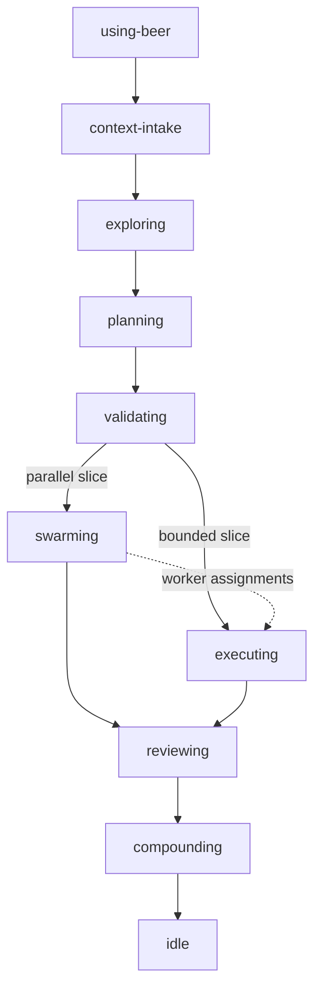
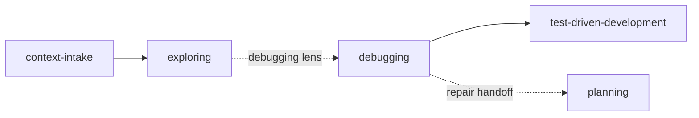

# Workflow Skills

`skills/workflow/` contains the explicit Beer workflow families.

## Family

| Family | Path | Purpose |
|---|---|---|
| `feature` | `skills/workflow/feature/` | feature routing, context recovery, planning, validation, execution, review, learnings, and repair/investigation support |

## Feature Flow

## Investigation / Repair Lens

## Related Docs

- [README](../../README.md)
- [Ecosystem Flow Overview](../../docs/ecosystem-flow-overview.md)
- [Support Skills](../support/README.md)
- [Meta Skills](../meta/README.md)
