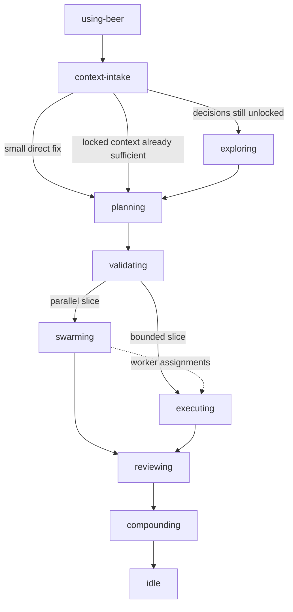
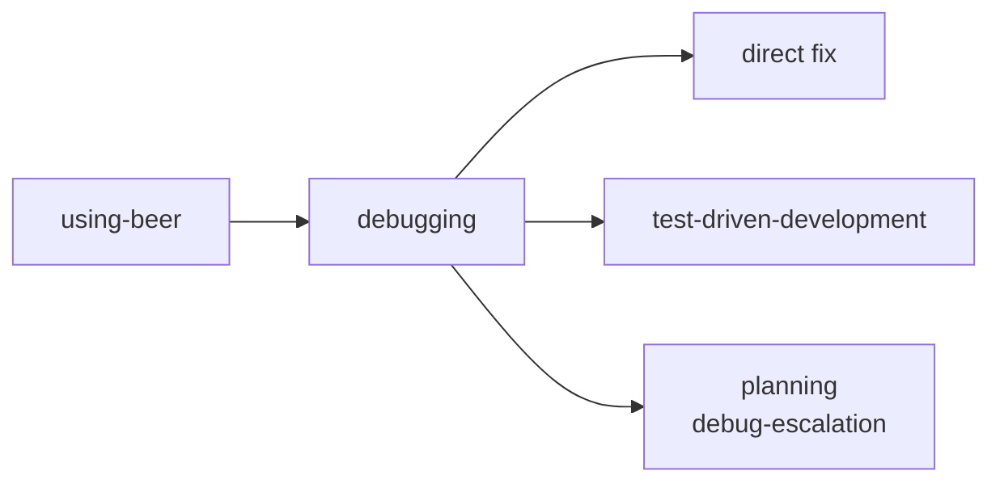

# Workflow Skills

`skills/workflow/` contains the explicit Beer workflow families.

## Families

| Family | Path | Purpose |
|---|---|---|
| `feature` | `skills/workflow/feature/` | feature routing, context recovery, planning, validation, execution, review, and learnings |
| `debug` | `skills/workflow/debug/` | root-cause, repair, and verification workflow |

## Feature Flow

## Debug Flow

## Related Docs

- [README](../../README.md)
- [Ecosystem Flow Overview](../../docs/ecosystem-flow-overview.md)
- [Support Skills](../support/README.md)
- [Meta Skills](../meta/README.md)
