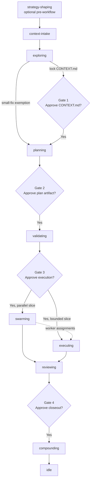

# using-beer

Load this first. `using-beer` checks onboarding, routes unclear feature direction through `strategy-shaping`, invokes workflow intake through `context-intake`, enforces the human gates around execution, and locks non-trivial work to the Beer route before coding starts.

---

## At a Glance

| | |
|---|---|
| **Use when** | Starting or resuming Beer workflow, choosing the next Beer skill, running `/go`, or routing non-trivial repo work |
| **Needs** | Node.js 18+, `bd` for workflow and swarm, optional GitNexus |
| **Produces** | Routing decision, state bootstrap, gate decisions |
| **Next** | The routed skill or gate handoff |

---

## 30-Second Version

1. **Preflight**: Run `node scripts/commands/beer-preflight.mjs --json` to probe dependencies and determine workflow readiness.
2. **Onboard or check state**: Run `node scripts/commands/onboard-beer.mjs --repo-root <path>` if needed.
3. **Normalize only when needed**: Use `prompt-leverage` only when the raw request needs repo, language, file, skill, or Beer-artifact context before routing.
4. **Shape strategy first when the task is not ready**: If the user is discussing direction, approach, tradeoffs, optimization, or overkill before choosing a task, route to `strategy-shaping`.
5. **Run intake first once the direction is chosen**: Hand raw request, optional strategy brief, and any contextual prompt packet to `context-intake` so it can recover or seed context for `exploring`.
6. **Use the exploring result**: `context-intake` always hands normal work to `exploring`; `exploring` decides whether to lock context or take the small-fix exemption into `planning`.
6. **Scout**: Read `node .beer/scripts/commands/beer-status.mjs --json`.
7. **Classify inside the session**: Use the current model to decide `route`, `work_intent`, `risk`, `run_style`, and `orchestration_strategy`.
8. **Lock the route**: State the chosen Beer skill and why coding is or is not allowed yet.
9. **Invoke**: Hand off to the appropriate explicit skill.

---

## Routing Catalog

Beer ships 18 skills in total. Workflow skills own the route and gates. Support
skills either run as bounded direct overlays or as helper lenses. Meta skills
manage Beer skill research and authoring work.

| Group | Skills |
|---|---|
| **Feature workflow** | `using-beer`, `strategy-shaping`, `context-intake`, `exploring`, `planning`, `validating`, `swarming`, `executing`, `reviewing`, `compounding` |
| **Investigation / repair lens** | `debugging` |
| **Support overlays** | `test-driven-development`, `codebase-knowledge`, `beer-agent-guidelines` |
| **Support helpers** | `prompt-leverage` (transformer), `graph-explore` |
| **Meta** | `writing-beer-skills`, `xia` |

---

## Routing Logic

### Session Classification

| Axis | Values | Use when... |
|---|---|---|
| `route` | `feature` / `small-fix` | Workflow path and upstream prerequisites |
| `work_intent` | `delivery` / `repair` / `investigation` | Whether the work is new delivery, a fix, or diagnosis |
| `risk` | `normal` / `high` | Reversibility, blast radius, or architecture sensitivity |
| `orchestration_strategy` | `single-worker` / `multi-worker` | How execution will be dispatched after validation |
| `run_style` | `guided` / `go` | How aggressively Beer moves across gates |

### First-Skill Routing

| Request shape | First skill | Notes |
|---|---|---|
| Discuss strategy, compare approaches, optimize scope, or decide whether a feature idea is overkill before the task is clear | `beer:strategy-shaping` | Pre-workflow consult layer. It produces a strategy brief and handoff seed, then returns to `context-intake` only after a direction is chosen |
| Build, change, investigate, or resume normal repo work | `beer:context-intake` | Intake gate. Recover or seed context first, then hand off to `exploring` |
| Small-fix work | `beer:context-intake` | Intake still hands off to `exploring`; `exploring` may take the small-fix exemption into compact planning |
| Locked-context implementation task | `beer:context-intake` | Intake reopens the current state, then hands off to `exploring` |
| Use TDD, write test first, or add regression test before fixing | `beer:test-driven-development` | Direct only for bounded TDD work; feature-sized requests return to the normal Beer route before production changes |
| Review or verify completed work | `beer:reviewing` | Jump straight to review flow |
| Debug failing behavior | `beer:debugging` | Root-cause lens inside the active Beer flow; if no usable context exists, recover through `beer:context-intake` first |
| Edit Beer itself | `beer:writing-beer-skills` or `beer:xia` | Use meta skills for ecosystem work |
| Analyze or compare an external skills repo | `beer:xia` | Produce a curation brief before changing Beer skills |
| Build, scan, or refresh generated project Docs | `beer:codebase-knowledge` | Direct route only when the user explicitly asks for generated Docs work |
| Install or refresh Karpathy-style repo guardrails | `beer:beer-agent-guidelines` | Sync `CLAUDE.md` and `AGENTS.md`, then continue under those instructions |
| Capture shipped learnings | `beer:compounding` | End-of-cycle flywheel |

Internal helpers stay off the main first-skill table. Pull them in only when an
active skill needs prompt transformation, graph depth, or read-only generated
Docs context. Helper output informs the owner; it does not approve gates,
mutate state, or replace `context-intake`.

**When in doubt:** if the user is still choosing a direction, use `beer:strategy-shaping`; if the task direction is already chosen, start with `beer:context-intake` and let intake hand the task to `exploring`.

### Helper Overlay

Use helpers as lenses, not routes:

| Helper | When `using-beer` may pull it in | Return |
|---|---|---|
| `prompt-leverage` | Raw request is mixed-language, ambiguous, or references repo files, skills, commands, or Beer artifacts that need context before routing | Raw request plus contextual prompt packet; route from both |
| `graph-explore` | An active workflow skill needs GitNexus-backed structure, route, process, impact, or API evidence | Read-only evidence packet to the calling skill |

`prompt-leverage` never replaces the raw request, never bypasses `context-intake`, and never mutates `.beer/state.json`. `graph-explore` never becomes the active route and never creates or refreshes generated `Docs/`.

### Support Overlay

- `test-driven-development` is direct only for bounded fail-first work; feature-sized scope returns to the normal Beer route.
- `codebase-knowledge` is direct only for explicit generated `Docs/` scan/build/refresh work or compounding-approved refresh.
- `beer-agent-guidelines` edits repo instruction files; instruction-only requests should not trigger full Beer refresh unless the user explicitly asks for managed-file refresh/install/update.
- Every support/helper call must hand back a compact packet: `status`,
  `evidence`, `decision_or_guardrail`, `state_changes_or_none`, `return_to`,
  and `next_owner`. If the packet exposes new implementation work, route back
  into the workflow owner instead of continuing inside the support/helper skill.

## Flow Lock

Beer is not optional once the repo is onboarded and the task is not trivial.

- Do not ask a few task-shaping questions and then code outside the route.
- Do not skip from `using-beer`, `strategy-shaping`, or `context-intake` straight into implementation unless the route is explicitly a trivial bypass or an approved execution path.
- Before any code edit on non-trivial work, announce:
  - current Beer skill
  - why that skill is the right route
  - what gate, approval, or condition allows the next step
- If the required route is missing or blocked, stop and surface the blocker instead of coding around Beer state.

### Trivial Escape Hatch

Bypass Beer only when all of these are true:

- the task is read-only or non-behavioral
- the change is local and obviously reversible
- no planning, validation, or locked product decision is needed
- no constructor, factory, event, DTO, command, or value-object contract must be inferred

Typical allowed examples:

- status or environment questions
- comment or copy edits
- tiny formatting or non-behavioral text changes

If any doubt remains, route through `beer:context-intake`.

---

## Go Run Style (4 Human Gates)

Trigger: `/go [feature]` or "run full pipeline"



| Gate | When | Ask |
|---|---|---|
| **GATE 1** | After exploring when `CONTEXT.md` was written | "Approve `CONTEXT.md` before planning?" |
| **GATE 2** | After planning | "Approve `phase-plan.md` or compact plan before current-phase prep?" |
| **GATE 3** | After validating | "Approve execution target: `swarming` or direct `executing`?" |
| **GATE 4** | After reviewing | "Approve closeout and compounding?" |

See `references/workflow.md#go-run-style-full-pipeline` for the detailed sequence.

---

## Resume Logic

If `.beer/HANDOFF.json` exists:

1. Read `HANDOFF.json` and `.beer/state.json`.
2. Extract `phase`, `skill`, `feature`, and `next_action`.
3. Present the saved state to the user.
4. Do **not** auto-resume without confirmation.

---

## Priority Rules

1. P1 review findings block merge.
2. Context above 65% means write a handoff and pause.
3. `history/<feature>/CONTEXT.md` is the source of truth for locked decisions.
4. `.beer/seed/` is inferred context only and must flow through `beer:exploring`.
5. Gate 3 is the irreversible point for execution.
6. Failed spikes send the work back to planning.
7. Never skip validating for feature work.
8. Read `history/learnings/critical-patterns.md` before planning when it exists.
9. Small, local, low-ambiguity fixes under 3 files still pass through intake and `exploring`; only `exploring` may take the small-fix exemption into compact planning.
10. Non-trivial coding work does not start until Beer route lock is explicit.
11. Build failures are not an acceptable substitute for checking exact contracts before implementation.

---

## Dependency Reality

| Route | Minimum working dependency set |
|---|---|
| Onboarding / status only | `node` |
| Small guided work | `node` |
| Standard flow | `node` + `bd` |
| Swarm execution path | `node` + `bd` |
| Graph-augmented research | configured GitNexus MCP server plus an indexed repo |

If a dependency is missing, route to the highest viable path instead of pretending the full workflow is still available.

---

## Session Model

### Axes

| Axis | Values | Meaning |
|---|---|---|
| `route` | `feature`, `small-fix` | Workflow shape and prerequisite chain |
| `work_intent` | `delivery`, `repair`, `investigation` | Why the current work exists inside that route |
| `risk` | `normal`, `high` | Change danger and reversibility |
| `orchestration_strategy` | `single-worker`, `multi-worker` | Execution dispatch after planning and validation |
| `run_style` | `guided`, `go` | Gate behavior and automation preference |

### Typical combinations

| Combination | Use when | Typical path |
|---|---|---|
| Strategy-first feature discussion | Direction, approach, tradeoff, or overkill is not settled yet | `using-beer -> strategy-shaping -> context-intake` once the user chooses the direction |
| `route = small-fix`, `work_intent = repair`, `risk = normal`, `orchestration_strategy = single-worker`, `run_style = guided` | Tiny bug fix, typo, bounded refactor | `using-beer -> context-intake -> exploring -> planning -> validating -> executing` with a compact plan/check note and validator gate |
| `route = feature`, `work_intent = delivery`, `risk = normal`, `orchestration_strategy = single-worker`, `run_style = guided` | Normal feature work with one bounded implementation stream | Full workflow with one worker plus validator/review gates |
| `route = feature`, `work_intent = repair`, `risk = normal|high`, `orchestration_strategy = single-worker`, `run_style = guided` | Broader repair work after a bug or failing build/test is understood | Same main workflow, but planning and validation stay anchored to the proven failure path |
| `route = feature`, `risk = normal|high`, `orchestration_strategy = multi-worker`, `run_style = guided` | Feature work that decomposes cleanly into disjoint slices | Full workflow plus worker dispatch, coordination, and stricter validation |
| `run_style = go` | Trusted end-to-end run preference | Same workflow, but Beer can auto-move where confidence allows |

### Decision Order

1. User preference from `.beer/config.json`
2. Current repo state and workflow reality
3. Live request understanding in `using-beer`
4. If confidence is low, ask the user whether to keep the proposed route/strategy or raise the rigor
5. Auto default

`node .beer/scripts/commands/beer-status.mjs --json` surfaces the normalized config snapshot. `using-beer` interprets that snapshot when choosing the route; support scripts do not auto-route the session on their own.

Do not treat keyword heuristics as the long-term source of truth for route or orchestration selection. If the classifier is uncertain, ask the user whether to keep the proposed route/strategy or raise the rigor.

### Strategy Differences

| Phase | Single-Worker | Multi-Worker |
|---|---|---|
| Context | Same intake and context lock | Same intake and context lock |
| Plan | One bounded execution stream, compact slice map | Multiple disjoint slices with explicit ownership |
| Validate | Confirm one worker is enough and proof target is credible | Confirm slice boundaries, worker count, and merge safety |
| Execute | Direct execution after Gate 3 | Dispatch coordinated worker slices after Gate 3 |
| Review | One implementation stream plus validator checks | Aggregated worker output plus validator checks |
| Compound | Same closeout obligations | Same closeout obligations |

---

## Auto-Accept Run Style

Enable `auto_accept` to let Beer move between gates automatically when risk and confidence allow it. Store the active runtime value in `.beer/state.json`; `.beer/config.json` only seeds the default preference.

```json
{
  "auto_accept": {
    "enabled": false,
    "planning": false,
    "validating": false,
    "swarming": false,
    "reviewing": false,
    "compounding": false
  }
}
```

Even with auto-accept enabled:

- P1 findings still block.
- Low-confidence or still-seeded context can disable downstream auto-accept.
- Required TDD evidence must be complete before automatic review handoff.
- Human approval is still required when the workflow says risk is unclear.

See `references/workflow.md#go-run-style-full-pipeline`.

---

## Handoff Phrase

```text
Skill routed. Invoke `beer:[skill-name]`.
```

For `run_style = go`:

```text
GATE [N] reached. Run the auto-accept policy; proceed only on ALLOW, otherwise pause for approval.
```

---

## References

- `references/workflow.md` - onboarding, state bootstrap, go run style, context intake
- `references/communication.md` - communication standards
- `references/quick-ref.md` - commands, files, and chaining contract
