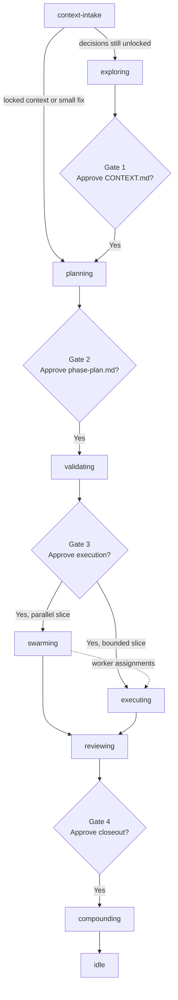

# using-beer

Load this first. `using-beer` checks onboarding, invokes workflow intake through `context-intake`, and enforces the human gates around execution.

---

## At a Glance

| | |
|---|---|
| **Use when** | Starting a Beer session, resuming, choosing a skill, or running `/go` |
| **Needs** | Node.js 18+, `bd` for workflow and swarm, optional GitNexus |
| **Produces** | Routing decision, state bootstrap, gate decisions |
| **Next** | The routed skill or gate handoff |

---

## 30-Second Version

1. **Preflight**: Run `node scripts/commands/beer-preflight.mjs --json` to probe dependencies and determine degradation mode.
2. **Onboard or check state**: Run `node scripts/commands/onboard-beer.mjs --repo-root <path>` if needed.
3. **Run intake first**: Hand normal task work to `context-intake` so it can recover context and choose between `planning` and `exploring`.
4. **Use the intake result**: If the task is a small direct fix, intake may route straight to `planning`; if decisions remain unlocked, intake routes to `exploring`.
5. **Scout**: Read `node .beer/scripts/commands/beer-status.mjs --json`.
6. **Classify inside the session**: Use the current model to decide `mode`, `risk`, `run_style`, and first route. If mode confidence is low, ask the user whether to keep the proposed mode or raise it.
7. **Invoke**: Hand off to the appropriate explicit skill.

---

## Routing Catalog

Beer ships 17 skills in total. The public surface focuses on day-to-day workflow and support skills, while helper and meta skills run in the background when needed.

| Group | Skills |
|---|---|
| **Feature workflow** | `using-beer`, `context-intake`, `exploring`, `planning`, `validating`, `swarming`, `executing`, `reviewing`, `compounding` |
| **Debug workflow** | `debugging` |
| **Support** | `test-driven-development`, `codebase-knowledge`, `beer-agent-guidelines` |
| **Helpers** | `prompt-leverage` (transformer), `graph-explore` |
| **Meta** | `writing-beer-skills`, `xia` |

---

## Routing Logic

### Session Classification

| Axis | Values | Use when... |
|---|---|---|
| `mode` | `small` / `standard` | Task size and workflow depth |
| `risk` | `normal` / `high` | Reversibility, blast radius, or architecture sensitivity |
| `run_style` | `guided` / `go` | How aggressively Beer moves across gates |

### First-Skill Routing

| Request shape | First skill | Notes |
|---|---|---|
| Build, change, investigate, or resume normal repo work | `beer:context-intake` | Intake gate. Recover context first, then route to `planning` or `exploring` |
| Small direct fix | `beer:context-intake` | Intake may route directly to `planning` with `mode = small` when the fix is local, low ambiguity, and likely under 3 files |
| Locked-context implementation task | `beer:context-intake` | Intake reopens the current state and typically routes to `planning` |
| Use TDD, write test first, or add regression test before fixing | `beer:test-driven-development` | Can run directly or be invoked by `executing` / `debugging` |
| Review or verify completed work | `beer:reviewing` | Jump straight to review flow |
| Debug failing behavior | `beer:debugging` | Root-cause first |
| Edit Beer itself | `beer:writing-beer-skills` or `beer:xia` | Use meta skills for ecosystem work |
| Analyze or compare an external skills repo | `beer:xia` | Produce a curation brief before changing Beer skills |
| Install or refresh Karpathy-style repo guardrails | `beer:beer-agent-guidelines` | Sync `CLAUDE.md` and `AGENTS.md`, then continue under those instructions |
| Capture shipped learnings | `beer:compounding` | End-of-cycle flywheel |

Internal helpers stay off the main first-skill table. Pull them in only when an active skill needs prompt transformation, graph depth, or a background pattern cache.

**When in doubt:** start with `beer:context-intake` for normal task work. Let intake decide whether the next phase is `planning` or `exploring`.

---

## Go Run Style (4 Human Gates)

Trigger: `/go [feature]` or "run full pipeline"



| Gate | When | Ask |
|---|---|---|
| **GATE 1** | After exploring | "Approve `CONTEXT.md` before planning?" |
| **GATE 2** | After planning | "Approve `phase-plan.md` before current-phase prep?" |
| **GATE 3** | After validating | "Approve execution target: `swarming` or direct `executing`?" |
| **GATE 4** | After reviewing | "Approve closeout and compounding?" |

See `references/workflow.md#go-mode` for the detailed sequence.

---

## Resume Logic

If `.beer/HANDOFF.json` exists:

1. Read `HANDOFF.json` and `.beer/state.json`.
2. Extract `phase`, `skill`, `feature`, and `next_action`.
3. Present the saved state to the user.
4. Do **not** auto-resume without confirmation.

---

## Priority Rules

1. P1 review findings block merge.
2. Context above 65% means write a handoff and pause.
3. `history/<feature>/CONTEXT.md` is the source of truth for locked decisions.
4. `.beer/seed/` is inferred context only and must flow through `beer:exploring`.
5. Gate 3 is the irreversible point for execution.
6. Failed spikes send the work back to planning.
7. Never skip validating for feature work.
8. Read `history/learnings/critical-patterns.md` before planning when it exists.
9. Small, local, low-ambiguity fixes under 3 files still pass through intake, but intake can route them straight to `planning` without `exploring`.

---

## Dependency Reality

| Route | Minimum working dependency set |
|---|---|
| Onboarding / status only | `node` |
| Small guided work | `node` |
| Standard flow | `node` + `bd` |
| Swarm execution path | `node` + `bd` |
| Graph-augmented research | configured GitNexus MCP server plus an indexed repo |

If a dependency is missing, route to the highest viable path instead of pretending the full workflow is still available.

---

## Session Model

### Axes

| Axis | Values | Meaning |
|---|---|---|
| `mode` | `small`, `standard` | Workflow size and artifact depth |
| `risk` | `normal`, `high` | Change danger and reversibility |
| `run_style` | `guided`, `go` | Gate behavior and automation preference |

### Typical combinations

| Combination | Use when | Typical path |
|---|---|---|
| `mode = small`, `risk = normal`, `run_style = guided` | Bug fix, typo, bounded refactor | `using-beer -> context-intake -> planning -> validating -> executing` with lightweight validation and optional lightweight review/compounding follow-up |
| `mode = standard`, `risk = normal`, `run_style = guided` | Normal feature work | Full workflow with normal gates |
| `mode = standard`, `risk = high`, `run_style = guided` | Cross-cutting or hard-to-reverse change | Full workflow plus stricter research and spikes |
| `run_style = go` | Trusted end-to-end run preference | Same workflow, but Beer can auto-move where confidence allows |

### Decision Order

1. User preference from `.beer/config.json`
2. Current repo state and workflow reality
3. Live request understanding in `using-beer`
4. If confidence is low, ask the user whether to keep the proposed mode or raise it
5. Auto default

`node .beer/scripts/commands/beer-status.mjs --json` surfaces the normalized config snapshot. `using-beer` interprets that snapshot when choosing the route; support scripts do not auto-route the session on their own.

Do not treat keyword heuristics as the long-term source of truth for mode selection. If the classifier is uncertain, ask the user whether to keep the proposed mode or raise it.

### Mode Differences

| Phase | Small Mode | Standard Mode |
|---|---|---|
| Context | Lighter bootstrap | Full intake, seed, and locked-context flow |
| Plan | 1-3 beads | Story map + phase contract + bead graph |
| Validate | Lightweight gate before execution | 8-dimension validation |
| Execute | Direct single-worker path after validation | Swarming + workers |
| Review | Optional lightweight follow-up | Full review flow + UAT |
| Compound | Optional when nothing reusable emerged | Expected at feature close |

---

## Auto-Accept Mode

Enable `auto_accept` to let Beer move between gates automatically when risk and confidence allow it. Store the active runtime value in `.beer/state.json`; `.beer/config.json` only seeds the default preference.

```json
{
  "auto_accept": {
    "enabled": false,
    "planning": false,
    "validating": false,
    "swarming": false,
    "reviewing": false,
    "compounding": false
  }
}
```

Even with auto-accept enabled:

- P1 findings still block.
- Low-confidence or still-seeded context can disable downstream auto-accept.
- Required TDD evidence must be complete before automatic review handoff.
- Human approval is still required when the workflow says risk is unclear.

See `references/workflow.md#go-mode`.

---

## Handoff Phrase

```text
Skill routed. Invoke `beer:[skill-name]`.
```

For `run_style = go`:

```text
GATE [N] reached. Run the auto-accept policy; proceed only on ALLOW, otherwise pause for approval.
```

---

## References

- `references/workflow.md` - onboarding, state bootstrap, go run style, context intake
- `references/communication.md` - communication standards
- `references/quick-ref.md` - commands, files, and chaining contract
