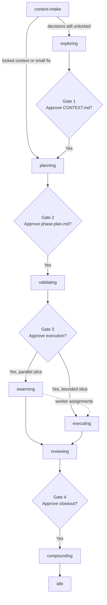

# using-beer

Load this first. `using-beer` checks onboarding, invokes workflow intake through `context-intake`, enforces the human gates around execution, and locks non-trivial work to the Beer route before coding starts.

---

## At a Glance

| | |
|---|---|
| **Use when** | Starting a Beer session, resuming, choosing a skill, or running `/go` |
| **Needs** | Node.js 18+, `bd` for workflow and swarm, optional GitNexus |
| **Produces** | Routing decision, state bootstrap, gate decisions |
| **Next** | The routed skill or gate handoff |

---

## 30-Second Version

1. **Preflight**: Run `node scripts/commands/beer-preflight.mjs --json` to probe dependencies and determine workflow readiness.
2. **Onboard or check state**: Run `node scripts/commands/onboard-beer.mjs --repo-root <path>` if needed.
3. **Run intake first**: Hand normal task work to `context-intake` so it can recover context and choose between `planning` and `exploring`.
4. **Use the intake result**: If the task is a small direct fix, intake may route straight to `planning`; if decisions remain unlocked, intake routes to `exploring`.
5. **Scout**: Read `node .beer/scripts/commands/beer-status.mjs --json`.
6. **Classify inside the session**: Use the current model to decide `route`, `risk`, `run_style`, and `orchestration_strategy`.
7. **Lock the route**: State the chosen Beer skill and why coding is or is not allowed yet.
8. **Invoke**: Hand off to the appropriate explicit skill.

---

## Routing Catalog

Beer ships 17 skills in total. The public surface focuses on day-to-day workflow and support skills, while helper and meta skills run in the background when needed.

| Group | Skills |
|---|---|
| **Feature workflow** | `using-beer`, `context-intake`, `exploring`, `planning`, `validating`, `swarming`, `executing`, `reviewing`, `compounding` |
| **Investigation / repair lens** | `debugging` |
| **Support** | `test-driven-development`, `codebase-knowledge`, `beer-agent-guidelines` |
| **Helpers** | `prompt-leverage` (transformer), `graph-explore` |
| **Meta** | `writing-beer-skills`, `xia` |

---

## Routing Logic

### Session Classification

| Axis | Values | Use when... |
|---|---|---|
| `route` | `feature` / `small-fix` | Workflow path and upstream prerequisites |
| `work_intent` | `delivery` / `repair` / `investigation` | Whether the work is new delivery, a fix, or diagnosis |
| `risk` | `normal` / `high` | Reversibility, blast radius, or architecture sensitivity |
| `orchestration_strategy` | `single-worker` / `multi-worker` | How execution will be dispatched after validation |
| `run_style` | `guided` / `go` | How aggressively Beer moves across gates |

### First-Skill Routing

| Request shape | First skill | Notes |
|---|---|---|
| Build, change, investigate, or resume normal repo work | `beer:context-intake` | Intake gate. Recover context first, then route to `planning` or `exploring` |
| Small direct fix | `beer:context-intake` | Intake may route directly to `planning` when the fix is local, low ambiguity, and likely under 3 files |
| Locked-context implementation task | `beer:context-intake` | Intake reopens the current state and typically routes to `planning` |
| Use TDD, write test first, or add regression test before fixing | `beer:test-driven-development` | Can run directly or be invoked by `executing` / `debugging` |
| Review or verify completed work | `beer:reviewing` | Jump straight to review flow |
| Debug failing behavior | `beer:debugging` | Root-cause lens inside the active Beer flow |
| Edit Beer itself | `beer:writing-beer-skills` or `beer:xia` | Use meta skills for ecosystem work |
| Analyze or compare an external skills repo | `beer:xia` | Produce a curation brief before changing Beer skills |
| Install or refresh Karpathy-style repo guardrails | `beer:beer-agent-guidelines` | Sync `CLAUDE.md` and `AGENTS.md`, then continue under those instructions |
| Capture shipped learnings | `beer:compounding` | End-of-cycle flywheel |

Internal helpers stay off the main first-skill table. Pull them in only when an active skill needs prompt transformation, graph depth, or a background pattern cache.

**When in doubt:** start with `beer:context-intake` for normal task work. Let intake decide whether the next phase is `planning` or `exploring`.

## Flow Lock

Beer is not optional once the repo is onboarded and the task is not trivial.

- Do not ask a few task-shaping questions and then code outside the route.
- Do not skip from `using-beer` or `context-intake` straight into implementation unless the route is explicitly a trivial bypass or an approved execution path.
- Before any code edit on non-trivial work, announce:
  - current Beer skill
  - why that skill is the right route
  - what gate, approval, or condition allows the next step
- If the required route is missing or blocked, stop and surface the blocker instead of coding around Beer state.

### Trivial Escape Hatch

Bypass Beer only when all of these are true:

- the task is read-only or non-behavioral
- the change is local and obviously reversible
- no planning, validation, or locked product decision is needed
- no constructor, factory, event, DTO, command, or value-object contract must be inferred

Typical allowed examples:

- status or environment questions
- comment or copy edits
- tiny formatting or non-behavioral text changes

If any doubt remains, route through `beer:context-intake`.

---

## Go Run Style (4 Human Gates)

Trigger: `/go [feature]` or "run full pipeline"



| Gate | When | Ask |
|---|---|---|
| **GATE 1** | After exploring | "Approve `CONTEXT.md` before planning?" |
| **GATE 2** | After planning | "Approve `phase-plan.md` before current-phase prep?" |
| **GATE 3** | After validating | "Approve execution target: `swarming` or direct `executing`?" |
| **GATE 4** | After reviewing | "Approve closeout and compounding?" |

See `references/workflow.md#go-run-style-full-pipeline` for the detailed sequence.

---

## Resume Logic

If `.beer/HANDOFF.json` exists:

1. Read `HANDOFF.json` and `.beer/state.json`.
2. Extract `phase`, `skill`, `feature`, and `next_action`.
3. Present the saved state to the user.
4. Do **not** auto-resume without confirmation.

---

## Priority Rules

1. P1 review findings block merge.
2. Context above 65% means write a handoff and pause.
3. `history/<feature>/CONTEXT.md` is the source of truth for locked decisions.
4. `.beer/seed/` is inferred context only and must flow through `beer:exploring`.
5. Gate 3 is the irreversible point for execution.
6. Failed spikes send the work back to planning.
7. Never skip validating for feature work.
8. Read `history/learnings/critical-patterns.md` before planning when it exists.
9. Small, local, low-ambiguity fixes under 3 files still pass through intake, but intake can route them straight to `planning` without `exploring`.
10. Non-trivial coding work does not start until Beer route lock is explicit.
11. Build failures are not an acceptable substitute for checking exact contracts before implementation.

---

## Dependency Reality

| Route | Minimum working dependency set |
|---|---|
| Onboarding / status only | `node` |
| Small guided work | `node` |
| Standard flow | `node` + `bd` |
| Swarm execution path | `node` + `bd` |
| Graph-augmented research | configured GitNexus MCP server plus an indexed repo |

If a dependency is missing, route to the highest viable path instead of pretending the full workflow is still available.

---

## Session Model

### Axes

| Axis | Values | Meaning |
|---|---|---|
| `route` | `feature`, `small-fix` | Workflow shape and prerequisite chain |
| `work_intent` | `delivery`, `repair`, `investigation` | Why the current work exists inside that route |
| `risk` | `normal`, `high` | Change danger and reversibility |
| `orchestration_strategy` | `single-worker`, `multi-worker` | Execution dispatch after planning and validation |
| `run_style` | `guided`, `go` | Gate behavior and automation preference |

### Typical combinations

| Combination | Use when | Typical path |
|---|---|---|
| `route = small-fix`, `work_intent = repair`, `risk = normal`, `orchestration_strategy = single-worker`, `run_style = guided` | Tiny bug fix, typo, bounded refactor | `using-beer -> context-intake -> planning -> validating -> executing` with compact artifacts and validator gate |
| `route = feature`, `work_intent = delivery`, `risk = normal`, `orchestration_strategy = single-worker`, `run_style = guided` | Normal feature work with one bounded implementation stream | Full workflow with one worker plus validator/review gates |
| `route = feature`, `work_intent = repair`, `risk = normal|high`, `orchestration_strategy = single-worker`, `run_style = guided` | Broader repair work after a bug or failing build/test is understood | Same main workflow, but planning and validation stay anchored to the proven failure path |
| `route = feature`, `risk = normal|high`, `orchestration_strategy = multi-worker`, `run_style = guided` | Feature work that decomposes cleanly into disjoint slices | Full workflow plus worker dispatch, coordination, and stricter validation |
| `run_style = go` | Trusted end-to-end run preference | Same workflow, but Beer can auto-move where confidence allows |

### Decision Order

1. User preference from `.beer/config.json`
2. Current repo state and workflow reality
3. Live request understanding in `using-beer`
4. If confidence is low, ask the user whether to keep the proposed route/strategy or raise the rigor
5. Auto default

`node .beer/scripts/commands/beer-status.mjs --json` surfaces the normalized config snapshot. `using-beer` interprets that snapshot when choosing the route; support scripts do not auto-route the session on their own.

Do not treat keyword heuristics as the long-term source of truth for route or orchestration selection. If the classifier is uncertain, ask the user whether to keep the proposed route/strategy or raise the rigor.

### Strategy Differences

| Phase | Single-Worker | Multi-Worker |
|---|---|---|
| Context | Same intake and context lock | Same intake and context lock |
| Plan | One bounded execution stream, compact slice map | Multiple disjoint slices with explicit ownership |
| Validate | Confirm one worker is enough and proof target is credible | Confirm slice boundaries, worker count, and merge safety |
| Execute | Direct execution after Gate 3 | Dispatch coordinated worker slices after Gate 3 |
| Review | One implementation stream plus validator checks | Aggregated worker output plus validator checks |
| Compound | Same closeout obligations | Same closeout obligations |

---

## Auto-Accept Run Style

Enable `auto_accept` to let Beer move between gates automatically when risk and confidence allow it. Store the active runtime value in `.beer/state.json`; `.beer/config.json` only seeds the default preference.

```json
{
  "auto_accept": {
    "enabled": false,
    "planning": false,
    "validating": false,
    "swarming": false,
    "reviewing": false,
    "compounding": false
  }
}
```

Even with auto-accept enabled:

- P1 findings still block.
- Low-confidence or still-seeded context can disable downstream auto-accept.
- Required TDD evidence must be complete before automatic review handoff.
- Human approval is still required when the workflow says risk is unclear.

See `references/workflow.md#go-run-style-full-pipeline`.

---

## Handoff Phrase

```text
Skill routed. Invoke `beer:[skill-name]`.
```

For `run_style = go`:

```text
GATE [N] reached. Run the auto-accept policy; proceed only on ALLOW, otherwise pause for approval.
```

---

## References

- `references/workflow.md` - onboarding, state bootstrap, go run style, context intake
- `references/communication.md` - communication standards
- `references/quick-ref.md` - commands, files, and chaining contract
